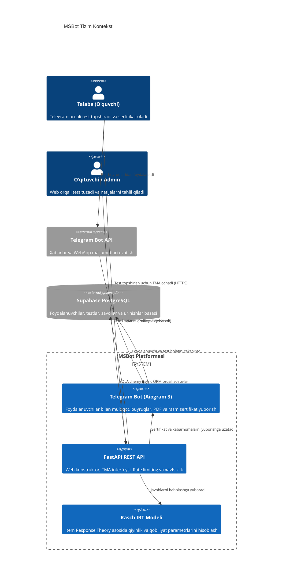
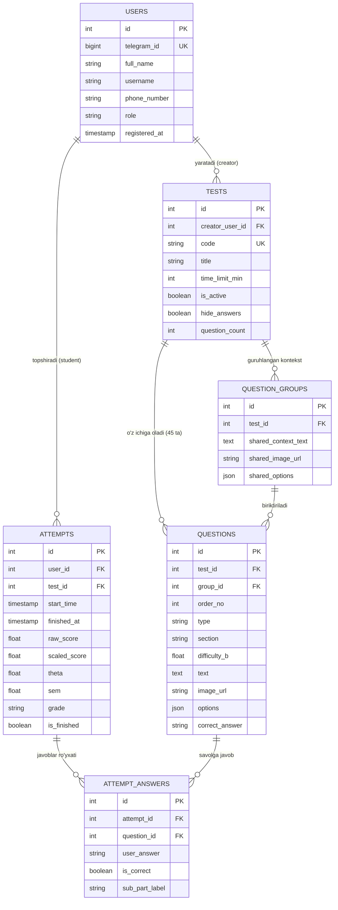
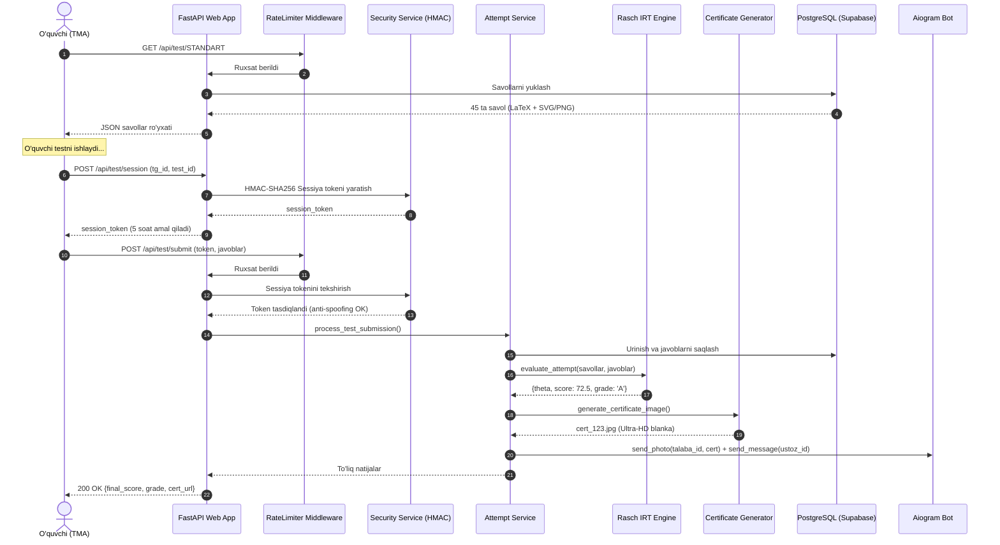

# 🏛️ MSBot Tizim Arxitekturasi (System Architecture)

Ushbu hujjat Milliy Sertifikat Matematika (MSBot) platformasining to'liq texnik me'morchiligi, ma'lumotlar oqimi, kiberxavfsizlik choralari va komponentlar o'rtasidagi munosabatlarni vizual diagrammalar (Mermaid) bilan tushuntiradi.

---

## 1. Yuqori Darajadagi C4 Konteyner Diagrammasi (High-Level Architecture)

---

## 2. Ma'lumotlar Bazasi Sxemasi (Entity-Relationship Diagram)

---

## 3. Test Topshirish va Baholash Oqimi (Sequence Flow)

---

## 4. Xavfsizlik Modeli (Security Architecture)

1. **Kirish Nazorati (Authentication & RBAC):**
   * Admin paneli faqat Telegram tomonidan imzolangan `X-Telegram-Init-Data` sarlavhasi bilan ochiladi.
   * `is_admin()` tekshiruvi orqali Super Admin va Admin rollari ajratiladi.
2. **Anti-Spoofing (Talaba Sessiyasi):**
   * Har bir test topshirish sessiyasi uchun unikal HMAC tokeni ishlatiladi, birov boshqa birovning `telegram_id` sini qo'lda yubora olmaydi.
3. **DDoS va Spam Himoyasi (Sliding Window Rate Limiter):**
   * Barcha API yo'llari IP va foydalanuvchi bo'yicha 60 soniyada 120 ta so'rov bilan cheklangan.
4. **Xavfsiz Muhit (Docker Non-Root):**
   * Docker konteyneri root huquqlarisiz (`appuser`, UID 1000) ishga tushadi.
